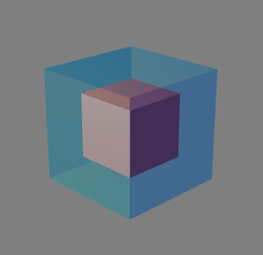

**3D Collision Detection**

Contributors Names: 	Mingyu Cui, Victor Da Silva

Contributor Emails: 	[mingyucu@usc.edu](mailto:mingyucu@usc.edu), [vdasilva@usc.edu](mailto:vdasilva@usc.edu) 

**1. Introduction**

The project we worked on was on the topic of 3D collisions between objects. This topic extended what we had learned from this class and the homeworks we had completed by not only rendering a still image of a 3D object (the teapot), but also dealing with animation and multiple objects interacting with each other. 

We encountered new challenges while working on this project that included runtime efficiency now that we needed to do calculations and render many times per second rather than once for a single image. There was also the challenge of grouping together vertices and faces in order for the program to distinguish between different objects. Throughout the process of working on this project, we pivoted as we gained more knowledge on the topic, and we continued to change our approach as we learned more about 3D object collisions. In the end, we successfully implemented a complete algorithm that efficiently detects collisions between objects of any convex shape.

**2. Framework: p5.js and WebGL**

We used the p5.js framework paired with WebGL to create our project. The choice to use these frameworks was made because they allowed us to blackbox the 3D rendering, lighting, and animation portions. This allowed us to put our main focus and attention into the 3D collision detection portion of the project.

p5.js allowed us to easily render the shapes; however, it also brought about new complications. The rendering function only takes the position and size of each shape, without any notion of objects and classes, which makes the grouping of vertices and faces difficult. With some object-oriented programming ideas, we decided to create a class for every primitive shape in p5.js: Sphere, Box, Plane, Cylinder, Cone, and Torus. All 6 classes inherit from a parent class called Obj, which declares all data fields such as position, velocity, and size of the objects.

As we developed the project, we realized the Narrow Phase algorithm required knowing all the vertex coordinates of a shape and the list of vertices each face contains. So we added more fields to the objects: vertexList that holds the coordinate of each vertex with respect to the center and faceList which stores 3 indices for each vertex in each triangular face in counter-clockwise order. We had to write code to generate vertices and populate these fields, because p5.js doesn’t allow access to the rendered shapes in such detail. 

For the Box and the Plane, it was relatively easy. We calculated the position of each vertex with respect to the center based on the object size, and split each rectangular face to 2 triangles. Finally, we wrote the vertex indices for each triangle manually. As a result, the Box contains 8 vertices and 12 faces; the Plane contains 4 vertices and 2 faces.

For the Sphere, it was more complicated. We first created a regular icosahedron by calculating the coordinates of the 12 vertices and manually wrote the indices of the 20 triangles. However, 20 faces is not an accurate approximation of a sphere, so we then interpolated each face into 4 by creating new vertices at the midpoint of every edge, and normalizing the new vertices to be on the sphere. Therefore, the Sphere has 42 vertices and 80 faces [1].

This way, we were able to approximate the position of vertices and faces of Sphere, Box, and Plane which helped us in Narrow Phase. The extension of our program to allow collision detection among other shapes should be simple as long as the vertex coordinates are given, or we can calculate the vertices from the mathematical expressions of the shape. 

**3. Initial Attempts**

Our initial approach was to create a very basic collision detection system between two Spheres, two Boxes, or a Sphere and Box. We made specific implementations for each of these three cases. After completing these specific algorithms where the shape of the objects in question needed to be specified every time, we wanted to create a more generic collision detection system. We wanted the system to be able to handle any type of shape without specifying beforehand: a one-size-fits-all algorithm. This type of system would help handle many more situations, and it led us to discovering research on Broad Phase and Narrow Phase Algorithms for collision detection.

**4. Collision Detection**

We split up the collision detection of all objects into two phases: the Broad Phase and the Narrow Phase [2]. During each frame, after the position of each object is updated, the Broad Phase function is called. The Broad Phase algorithm eliminates any pairs of objects that are definitely not colliding; for pairs of objects that are potentially colliding with each other, the Broad Phase algorithm calls the Narrow Phase function. The Narrow Phase algorithm then accurately determines for this potentially colliding pair of objects whether they are actually colliding by testing if they overlap in space. 

**5. The Broad Phase**

	To implement the Broad Phase, we first added a helpful field in each object: the size of the axis-aligned bounding box (AABB) [3]. We made the AABB large enough so that although the AABBs are not tightly bounding the objects so the Broad Phase might call the Narrow Phase more than needed, they do not need to be recalculated every frame. This way, the AABB is simply treated as a large-enough Cube encapsulating each object. For example, the AABB bounds a Sphere at its radius; for a Box, the size of the AABB is the diagonal of the Box so that no matter how the Box rotates, the AABB will always encapsulate the Box.

We implemented two methods of Broad Phase collision detection. First, we implemented the naive method: it checks every pair of objects and tests if they are close enough to possibly collide. This was an easy and correct method to program and we were able to split our tasks into optimizing the Broad Phase and implementing the Narrow Phase so that we could make progress more efficiently. The naive method checks every pair of objects, so it runs in O(n^2) time.

The second and optimized method for Broad Phase was Sort and Sweep. For each axis (x, y, and z) we sort the AABB start and end coordinates of each object along this axis. Then using a linear scan over the array of AABB start and end coordinates, we obtain a list of pairs of objects whose AABB overlaps along each axis.

Finally, taking the intersection among all 3 axes, we can find all pairs that can potentially be colliding and call the Narrow Phase for these pairs. This algorithm runs in O(nlog(n)) due to sorting so it is a big improvement from the naive algorithm [4].

**6. The Narrow Phase**

The next main section of our project was the implementation of the Narrow Phase Collision Detection Algorithm. This section allowed our program to precisely calculate whether 2 objects have collided. This is the final line of calculations in determining a collision, and for this reason it is only called when the broad phase triggers it. A large downside of the Narrow Phase is that it is much more computationally expensive to run than the Broad Phase, but the benefit is that the Narrow Phase is more accurate at determining collisions between two objects. 

There were a few common choices that we found for the Narrow Phase Algorithm, and we decided on the Separating Axis Theorem [5]. In the Separating Axis Theorem, we use every face of one of the objects and test if there is a plane that is parallel to one of the faces that can separate the two objects. By having access to the separating plane’s normal vector and the vertices from both objects, we are able to determine if all of the vertices from one object are on one side of the plane and all the vertices from the other object are on the other side of the plane. This theorem allowed us to draw upon our knowledge from the homeworks of 3D vertex positioning, triangle face composition, and surface normals. Extending on these core topics from the teapot homeworks, we were able to determine if a separating plane existed between the two objects in question. The two algorithms (Broad and Narrow Phases) running as a tag team help to achieve efficiency when possible, and precision when needed in determining collisions and overlaps between objects.

One main point to note is that many of the algorithms that handle the Narrow Phase avoid handling concave objects. This is because concave objects are much more difficult to detect collisions with. One of the objects could be in the concave portion of the other object, and this could trigger a false positive for the collision detection system. The other collision detection algorithms that we did research on would instead do more pre-processing work of splitting these concave shapes into multiple convex shapes. Others simply won’t deal with concave shapes at all. For this reason, we only dealt with convex shapes in our collision detection system to avoid unnecessary false positives that result from concave shapes.

**7. Code in Practice**

* Red: certainly not colliding. 

** **

* Green: might be colliding.

 

* Blue: certainly colliding. 

* Multiple collisions might be happening

* Correct result when a Sphere and a Box are against each other but not overlapping

* Correct result when a Sphere and a Box are overlapping by a small amount

**8. Conclusion**

In this project, we were able to implement an efficient version of the Broad Phase and Narrow Phase collision detection algorithms. We are proud of our accomplishment, although we could not support every shape p5.js supports given the time constraints. Despite this, we made an effort to ensure our code is easily extensible to support other shapes – as long as the vertexList and faceList is given or can be calculated. 

In addition, we also made sure our code was structured such that either the Broad Phase or the Narrow Phase algorithm could be easily replaced with another algorithm. This is because we also learned about other practical algorithms for collision detection that work well under different circumstances during our research. For example, the Broad Phase might use space partitioning algorithms such as BSP and Octree, while the GJK and the MPR algorithms work well for the Narrow Phase. In the future, we would like to learn how to implement these algorithms and their applications, and test them by replacing our current Sort and Sweep, and SAT algorithms. 

Overall, we learned about the Broad Phase, the Narrow Phase, and their use of 3D collision detection. We are very happy about our successful implementations of the Sort and Sweep and the SAT algorithm, as well as creating the helpful wrappers over the p5.js shapes.

**9. References**

[1] A. Kahler, "Creating an icosphere mesh in code," *catch 22 - Andreas Kahler's blog*, 2009. [Online]. Available: http://blog.andreaskahler.com/2009/06/creating-icosphere-mesh-in-code.html. [Accessed: 29-Apr-2021]. 

[2] N. Souto, "Video Game Physics Tutorial - Part II: Collision Detection for Solid Objects," *Toptal Engineering Blog*, 02-Mar-2015. [Online]. Available: https://www.toptal.com/game/video-game-physics-part-ii-collision-detection-for-solid-objects. [Accessed: 29-Apr-2021]. 

[3] M. Xie and X. Niu, "A 3D roaming and collision detection algorithm applicable for massive spatial data," *PloS one*, 21-Feb-2020. [Online]. Available: https://www.ncbi.nlm.nih.gov/pmc/articles/PMC7034826/. [Accessed: 29-Apr-2021]. 

[4] J. D. Cohen, M. C. Lin, D. Manocha, and M. Ponamgi, "I-COLLIDE: an interactive and exact collision detection system for large-scale environments," *ACM Digital Library*, 01-Apr-1995. [Online]. Available: https://dl.acm.org/doi/10.1145/199404.199437. [Accessed: 29-Apr-2021]. 

[5] S. P. Boyd and L. Vandenberghe, in *Convex Optimization*, Cambridge University Press, pp. 46–51. [Online]. Available: https://web.stanford.edu/~boyd/cvxbook/bv_cvxbook.pdf. [Accessed: 29-Apr-2021]. 

